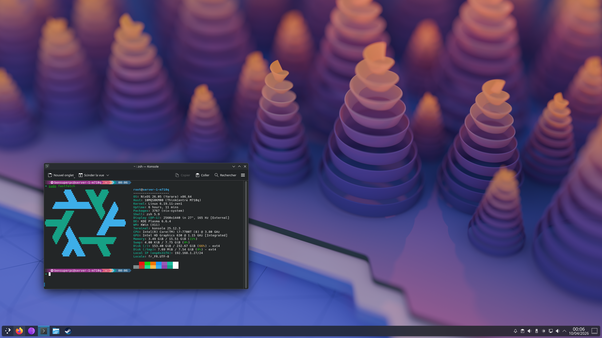

# NixOS Configuration

Multi-host NixOS flake configuration for personal machines and servers.

> **⚠️ Warning:** This repository is still under active development, expect changes and occasional breakage.

## Features

- Multi-host setup
- Profile/preset-based composition
- Independent user modules
- Separation of variables and configuration
- Shared modules and hardware drivers as separate modules
- Home Manager and **Plasma-manager** integration
- Colmena for remote deployment
- Docker-based helper commands via `Makefile`



## Repository Layout

```bash
.
├── devshells # Development shells
├── drivers # Hardware drivers
├── flake.lock # Flake lock file
├── flake.nix # Flake file and target
├── lib # Custom nix functions and helpers
├── Makefile
├── modules
│   ├── apps # Applications and services
│   │   ├── development # Development tools and libraries
│   │   ├── multimedia # Multimedia applications (Video, audio, image, etc.)
│   │   ├── games # Games and emulators
│   │   ├── custom # Custom applications
│   │   ├── desktop # Desktop-related configuration
│   │   ├── utilities # Utility applications
│   │   ├── network # Network-related configuration
│   │   ├── system # System-related configuration
│   │   └── docker # Docker-related configuration
│   └── gui # GUI related configuration (Display manager, desktop environment, etc.)
├── profiles # System profiles/presets (Desktop, server, etc.)
├── systems # System specific configuration
├── tests # NixOS tests
├── users # User specific configuration
└── variables # Global variables
```

## Hosts Defined in `systems/systems.nix`

- `server-1-m710q`
- `celestia` (WIP)
- `luna` (WIP)
- `rainbow-dash` (WIP)
- `fluttershy` (WIP)
- `pinkie-pie` (WIP)

## Prerequisites

- Linux machine with Nix installed
- Flakes enabled (`nix-command` + `flakes`)
- Optional for deployment:
  - `colmena`
  - `deploy-rs`
- Optional for Makefile workflow:
  - Docker

## Quick Start

### Validate the flake

```bash
nix flake show
nix flake check -L
```

### Build a host locally

```bash
nix build --extra-experimental-features "nix-command flakes" .#nixosConfigurations.server-1-m710q.config.system.build.toplevel
```

### Switch on a NixOS host

```bash
sudo nixos-rebuild switch --flake .#server-1-m710q
```

## Makefile Commands

General commands:

```bash
make update    # flake update
```

Host commands (for hosts listed in `SERVERS` inside `Makefile`):

```bash
make <host>.test   # dry-run build
make <host>.build  # build toplevel
make <host>.vm     # build VM
make <host>.push   # deploy with Colmena
```

> Note: `Makefile` host list and `systems/default.nix` host list should be kept in sync.

## Deployment

### Colmena

This flake exports `colmenaHive`.  
Example:

```bash
colmena apply --on server-1-m710q --show-trace --verbose
```

## How Host Configuration Is Composed

`lib/mksystem.nix` builds each host from:

1. `systems/<host>/configuration.nix` (with hardware configuration)
2. Selected profiles from `profiles/*.nix`
3. Selected users from `users/<name>/user.nix`
4. Shared modules from `modules/`
5. Hardware drivers from `drivers/`

Variable precedence is:

`global variables < system variables < user variables`

## Adding a New Host

1. Create:
   - `systems/<host>/configuration.nix` (with hardware configuration)
   - `systems/<host>/variables.nix`
2. Add the host entry in `systems/systems.nix`.
3. Optionally add it to `SERVERS` in `Makefile`.
4. Run:

```bash
make <host>.test
make <host>.push
```

## Useful Resources

- [NixOS](https://nixos.org/)
- [NixOS Wiki](https://nixos.wiki/)
- [NixOS Search (Packages)](https://search.nixos.org/packages)
- [NixOS Search (Options)](https://search.nixos.org/options)
- [MyNixOS](https://mynixos.com/)
- [Best of Nix](https://github.com/best-of-lists/best-of)
- [Nix Gaming](https://github.com/fufexan/nix-gaming/)

# Other NixOS Configurations

- [CageKiosk](https://github.com/stefansebekow/CageKiosk)
- [Midna](https://git.midna.dev/mjm/nix-config)
- [Natto1784](https://github.com/natto1784/dotfiles)
- [Fufexan](https://github.com/fufexan/dotfiles)
- [Tejing1](https://github.com/tejing1/nixos-config)
- [Ryan4yin](https://github.com/ryan4yin/nix-config)
