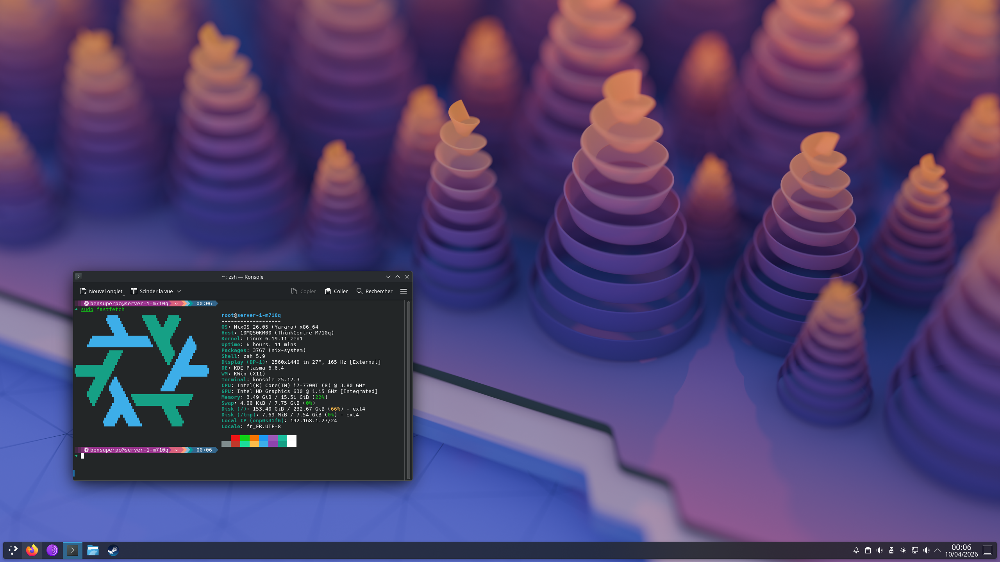

# NixOS Configuration

Multi-host NixOS flake for personal machines, family desktops, and servers.

> **⚠️ Warning:** This repository is under active development. Expect changes and occasional breakage.

## Highlights

- Multi-host setup for personal, family, server, and workstation systems
- Flake-based configuration with Colmena and deploy-rs deployment targets
- Home Manager and Plasma Manager integration
- Role-based composition (`minimal`, `server`, `desktop`, `workstation`, `family`)
- Profile-driven capabilities via `appProfiles`, `platformProfiles`, and `policyProfiles`
- Optional shared user configuration across hosts via `users/<name>/`
- Early validation through the host schema in `lib/host-schema.nix`
- Stable package selection via architecture-scoped `pkgsSets`
- Enum-based selection for kernel (`myConfig.boot.kernel`), GPU driver (`myConfig.drivers.gpu.intel`), desktop environment (`myConfig.gui.desktop`), and power backend (`myConfig.apps.power.management.backend`)
- Kebab-case module naming across desktop, GUI, and network components
- Makefile helpers for common maintenance and deployment tasks



## Repository Layout

```bash
.
├── assets              # Images and media
├── devshells           # Development shells
├── flake.lock          # Flake lock file
├── flake.nix           # Flake outputs and host wiring
├── lib
│   ├── host-schema.nix  # Host normalization, validation and role wiring
│   ├── mksystem.nix     # Per-host NixOS configuration builder
│   ├── module-helpers.nix  # Shared option helpers (mkEnabledOption, etc.)
│   └── role-presets.nix # Default profile sets for each role
├── Makefile
├── modules
│   ├── common      # Boot, network, audio, filesystem, SSH, …
│   ├── drivers     # GPU (Intel/AMD), Bluetooth, Wireless
│   ├── gui         # Desktop environment options (gui.nix) and implementations (kde-plasma.nix, …)
│   └── applications # Layer 2: user-facing software
│       ├── development  # IDEs, compilers, languages, tools
│       ├── multimedia   # Video, audio, image
│       ├── games        # Steam, emulators, Minecraft
│       ├── desktop      # Desktop integration, fonts, printing
│       ├── network      # Browsers, communication, torrent
│       ├── files        # Backup, sync, crypto
│       ├── utilities    # Misc tools, KVM, math, antivirus
│       ├── docker       # Docker and Compose services
│       └── custom       # Local custom packages
├── profiles            # Composable presets for platform, apps and policy
├── systems             # Per-host hardware configuration, host variables and global defaults
├── tests               # NixOS assertions (check-*.nix)
└── users               # Per-user system and Home Manager configuration
```

## Host Inventory

Defined in `systems/systems.nix`.

- `enabled = true` (default): host is included in global eval/build outputs.
- `enabled = false`: host stays in inventory but is excluded from global eval/build outputs.
- Hosts without an IP are excluded from remote deployment targets.

| Host | Role | Status |
|---|---|---|
| `server-1-m710q` | workstation | active |
| `fluttershy` | minimal | WIP |
| `discord-wsl` | wsl | active |
| `celestia` | family | WIP (disabled) |
| `luna` | family | WIP (disabled) |
| `rainbow-dash` | family | WIP (disabled) |
| `pinkie-pie` | desktop | WIP (disabled) |

## Prerequisites

- Linux machine with Nix installed
- Flakes enabled (`nix-command` + `flakes`)
- Optional for deployment:
  - `colmena`
  - `deploy-rs`
- Optional for Makefile workflow:
  - Docker

## Quick Start

### Validate the flake

```bash
nix flake show
nix flake check -L
```

### Build a host locally

```bash
nix build --extra-experimental-features "nix-command flakes" .#nixosConfigurations.server-1-m710q.config.system.build.toplevel
```

### Apply a host configuration locally

```bash
sudo nixos-rebuild switch --flake .#server-1-m710q
```

## Make Targets

Common targets:

```bash
make update        # flake update
make check         # flake check
make fmt           # format Nix files
make gc            # garbage collect (older than 7 days)
make all-systems   # show all system outputs
```

Per-host targets for entries listed in `SERVERS` in `Makefile`:

```bash
make <host>.test   # dry-run build
make <host>.build  # build top-level system closure
make <host>.vm     # build VM
make <host>.push   # deploy with Colmena (switch)
make <host>.boot   # deploy with Colmena (boot, then reboot)
```

Current `SERVERS` value: `server-1-m710q fluttershy discord-wsl`.

> Note: `Makefile` host list and `systems/systems.nix` host list should be kept in sync.

## Deployment

Hosts with a defined `ip` field are automatically included in Colmena and deploy-rs targets.
Only hosts with `enabled = true` are considered in flake outputs.

### Colmena

```bash
colmena apply --on server-1-m710q --show-trace --verbose
```

### Deploy-rs

```bash
deploy-rs deploy server-1-m710q
```

## Host Composition

`lib/mksystem.nix` builds each host from:

1. `systems/<host>/configuration.nix` (hardware + `system.stateVersion`)
2. All profiles resolved from role defaults + host `platformProfiles` + `appProfiles` + `policyProfiles`
3. User modules from `users/<name>/system.nix` for each user in `users`
4. Core modules (`modules/common/`, `modules/drivers/`, `modules/gui/`) and application modules (`modules/applications/`)

Modules receive the following inputs through `_module.args`:

- `varsUsers.<username>`: values from each `users/<name>/variables.nix`
- `varsHost`: host metadata (`name`, `role`, `enabled`, `users`, `deployUser`, `ip`, `port`)
- `pkgsSets.<channel>`: per-channel package sets (`stable`, `master`, `unstable`) resolved once per architecture

Locale and timezone settings use native NixOS options with `lib.mkDefault` in `modules/common/locales.nix`. Per-host overrides go directly in `systems/<host>/configuration.nix` using the standard NixOS option names:

```nix
time.timeZone                = "America/New_York";
i18n.defaultLocale           = "en_US.UTF-8";
services.xserver.xkb.layout = "us";
```

## Conventions

- Prefer lowercase hierarchical paths under `myConfig.apps.*` for new and refactored modules.
- Prefer `myConfig.apps.network.servers` over mixed camelCase names like `myConfig.apps.webServers`.
- Prefer `myConfig.apps.desktop.fonts` over broad names like `myConfig.apps.additionalFonts`.
- Desktop environment selection lives under `myConfig.gui.*` (not `myConfig.apps.*`).
- Module filenames use kebab-case when the name contains multiple words.

Preferred option paths:

```nix
myConfig.gui.desktop = "plasma";        # enum: none | plasma | lxqt
myConfig.gui.extraPackages = true;
myConfig.apps.power.management.services = true;
myConfig.apps.hardware.gui.tools = true;
myConfig.apps.network.cli.tooling = true;
myConfig.apps.network.servers.core = true;
myConfig.apps.desktop.fonts.nerdFonts = true;
```

Typical matching filenames:

```text
modules/gui/gui.nix                                  # myConfig.gui.* option declarations
modules/gui/kde-plasma.nix                           # plasma implementation
modules/applications/desktop/desktop-integration.nix
modules/applications/desktop/fonts.nix
modules/applications/network/web-servers.nix
```

## Host Roles

Roles are defined in `lib/host-schema.nix` and provide default `platformProfiles`, `appProfiles`, and `policyProfiles`. Hosts can extend or override those defaults.

| Role | Platform profiles | App profiles | Policy / extra profiles |
|---|---|---|---|
| `minimal` | `platform/base` | _(none)_ | _(none)_ |
| `server` | `platform/base` | `apps/docker` | _(none)_ |
| `wsl` | `platform/base`, `platform/no-gpu`, `platform/no-gui`, `platform/wsl` | `apps/docker` | _(none)_ |
| `desktop` | `platform/base`, `platform/kde-plasma` | `apps/custom`, `apps/desktop-runtime`, `apps/desktop`, `apps/multimedia`, `apps/utilities`, `apps/office` | `policy/kernel-zen` |
| `workstation` | `platform/base`, `platform/kde-plasma` | `apps/custom`, `apps/desktop-runtime`, `apps/desktop`, `apps/development`, `apps/multimedia`, `apps/utilities`, `apps/office` | `policy/kernel-zen` |
| `family` | `platform/base`, `platform/kde-plasma` | `apps/desktop`, `apps/communication`, `apps/multimedia`, `apps/office`, `apps/files`, `apps/utilities` | `policy/kernel-zen` |

## Adding a Host

1. Create four files under `systems/<host>/`:
  - `definition.nix` - role, profiles, IP, and users (see the example below)
  - `configuration.nix` - hardware configuration and `system.stateVersion`
  - `hardware-configuration.nix` - generated by `nixos-generate-config`
  - `variables.nix` - host-specific values such as hostname, timezone, locale, or keyboard layout overrides

   Global defaults for timezone, locale and keyboard layout are in `modules/common/locales.nix`; override per-host in `systems/<host>/configuration.nix` using standard NixOS option names (see the Host Composition section).

2. Register the host in `systems/systems.nix`:

```nix
"my-host" = import ./my-host/definition.nix;
```

Example `definition.nix`:

```nix
{
  enabled = true;             # optional, defaults to true
  role = "desktop";           # minimal | server | desktop | workstation | family
  system = "x86_64-linux";
  ip = "192.168.1.x";       # add when known
  port = 22;                # optional

  users = [ "bensuperpc" ];
  # deployUser = "bensuperpc"; # optional; defaults to the first entry in users
                               # must be one of the users above

  appProfiles      = [ "apps/games" "apps/docker" ]; # optional extras on top of the role
  platformProfiles = [ "platform/gpu-amd" "platform/wireless" ]; # hardware/driver profiles
  policyProfiles   = [ "policy/kernel-zen" ]; # kernel and system-wide policies
}
```

`users` is required and must be a list, not `user` or `userGroups`.

`platformProfiles` is used for both OS-layer settings and hardware/driver profiles (`platform/gpu-*`, `platform/bluetooth`, etc.).
`policyProfiles` is used for system-wide policies (`policy/kernel-*`, etc.).

3. Set `enabled = false` while provisioning files, then switch to `enabled = true` when ready.
4. Optionally add it to `SERVERS` in `Makefile`.
5. Run:

```bash
make <host>.test
make <host>.push   # once ip is set
```

## Driver Profiles

Hardware drivers are activated via `platformProfiles`:

| Profile | NixOS option set | Description |
|---|---|---|
| `platform/gpu-intel-old` | `myConfig.drivers.gpu.intel = "old"` | Intel iGPU (Sandy Bridge, Ivy Bridge, Haswell…) |
| `platform/gpu-intel-skylake` | `myConfig.drivers.gpu.intel = "skylake"` | Intel iGPU (Skylake to Raptor Lake) |
| `platform/gpu-intel-xe` | `myConfig.drivers.gpu.intel = "xe"` | Intel GPU (Xe / Arc, Alder Lake and newer) |
| `platform/gpu-amd` | `myConfig.drivers.gpu.amd.enable = true` | AMD GPU — combinable with an Intel profile |
| `platform/bluetooth` | `myConfig.drivers.bluetooth.enable = true` | Bluetooth stack |
| `platform/wireless` | `myConfig.drivers.wireless.enable = true` | Wireless networking |
| `platform/no-gpu` | _(assertion only)_ | Headless / server — asserts no GPU profile is active |

> `myConfig.drivers.gpu.intel` and `myConfig.drivers.gpu.amd.enable` can be set directly in `systems/<host>/configuration.nix` without a profile.

## GUI Profiles

Desktop environment is activated via `platformProfiles`:

| Profile | `myConfig.gui.desktop` value | Description |
|---|---|---|
| `platform/kde-plasma` | `"plasma"` | KDE Plasma 6 — sets `myConfig.gui.desktop = "plasma"` and `myConfig.gui.extraPackages = true` |
| `platform/no-gui` | _(assertion only)_ | Headless — asserts `myConfig.gui.desktop == "none"` and no Xorg/Wayland services active |

> `myConfig.gui.desktop` can also be set directly in `systems/<host>/configuration.nix` without a profile.

## Policy Profiles

Policy profiles are activated via role defaults or `policyProfiles`:

| Profile | `myConfig.boot.kernel` value | Description |
|---|---|---|
| `policy/kernel-latest` | `"latest"` | Latest upstream kernel |
| `policy/kernel-zen` | `"zen"` | Zen kernel — desktop/gaming optimised |
| `policy/kernel-latest-libre` | `"libre"` | Latest libre kernel (no binary blobs) |
| `policy/kernel-latest-hardened` | `"hardened"` | Latest hardened kernel (security-focused) |
| `policy/kernel-lts` | `"lts"` | LTS kernel — set `myConfig.boot.kernel = "lts"` directly |

> `myConfig.boot.kernel` can also be set directly in `systems/<host>/configuration.nix` without a profile.

## Contributing

Contributions are welcome, especially around module cleanup, option naming consistency, host profile coverage, and documentation.

Before opening a change:

- Run `nix flake check -L`
- Keep `Makefile` host targets aligned with `systems/systems.nix`
- Prefer lowercase option namespaces under `myConfig.apps.*` for new work
- Keep changes scoped and avoid unrelated refactors

## Useful Resources

- [NixOS](https://nixos.org/)
- [NixOS Wiki](https://nixos.wiki/)
- [NixOS Search (Packages)](https://search.nixos.org/packages)
- [NixOS Search (Options)](https://search.nixos.org/options)
- [MyNixOS](https://mynixos.com/)
- [Best of Nix](https://github.com/best-of-lists/best-of)
- [Nix Gaming](https://github.com/fufexan/nix-gaming/)

## Other NixOS Configurations

- [CageKiosk](https://github.com/stefansebekow/CageKiosk)
- [Midna](https://git.midna.dev/mjm/nix-config)
- [Natto1784](https://github.com/natto1784/dotfiles)
- [Fufexan](https://github.com/fufexan/dotfiles)
- [Tejing1](https://github.com/tejing1/nixos-config)
- [Ryan4yin](https://github.com/ryan4yin/nix-config)
- [Phip1611](https://github.com/phip1611/nixos-configs)
- [Haseeb Majid](https://haseebmajid.dev/posts/2024-07-30-how-i-setup-btrfs-and-luks-on-nixos-using-disko/)
