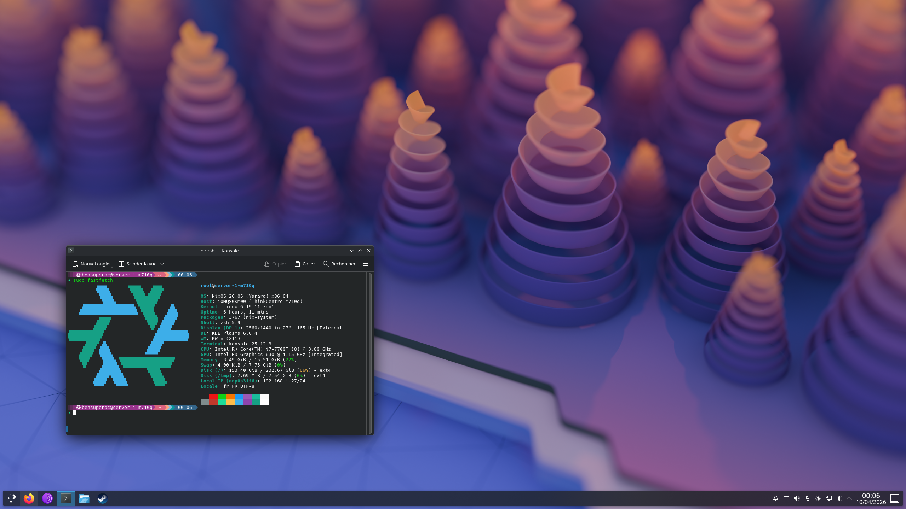

# NixOS Configuration

[](https://github.com/bensuperpc/nixos_config/actions/workflows/ci.yml)

This repository contains my personal NixOS flake used to manage my desktops, servers, and a few family machines.

> **⚠️ Warning:** This repository is under active development, expect changes and occasional breakage.

## Highlights

- Multi-host setup for personal, family, server, and workstation systems
- Flake-based configuration deployed with Colmena (checked to build exactly `nixosConfigurations`)
- Home Manager and KDE Plasma 6 desktop environment
- Declarative disk partitioning with **disko** and impermanence
- Role-based composition (`minimal`, `server`, `desktop`, `workstation`, `full`, `family`)
- Profile-driven capabilities via a single `profiles` list (`platform/*`, `apps/*`, `policy/*`)
- Shared user configuration across hosts via `users/<name>/`
- Deterministic package versions + individual packages pinned to the stable channel via `pkgsSets`
- Devshells for C/C++ (GCC, Clang), WebAssembly, embedded compilers, Qt6, raylib, Python 3.13 and 2, Rust, Java 21, and ESP-IDF (ESP32-C5/C6/P4)
- Makefile helpers for common maintenance, validation, and deployment tasks
- `microvm.nix` host support (WIP) for running lightweight VMs



## Repository Layout

```bash
.
├── .github/workflows    # CI: gitleaks + `nix flake check`
├── .sops.yaml           # sops-nix recipients and one creation rule per host file
├── assets               # Images and media
├── devshells            # Development shells
├── flake
│   ├── checks.nix       # Flake checks (= CI)
│   ├── dev.nix          # Formatter, packages and devshells
│   └── hosts.nix        # Package sets, hosts, Colmena hive
├── flake.lock           # Flake lock file
├── flake.nix            # Flake inputs
├── lib
│   ├── disko-presets.nix   # Shared GPT + ESP + LUKS + btrfs layout
│   ├── host-schema.nix  # Host options (typed), validation and role wiring
│   ├── mksystem.nix     # Per-host NixOS configuration builder
│   ├── module-helpers.nix  # Shared helpers (mkEnabledOption, mkPackageGroupModule, mkDefaults)
│   └── role-presets.nix    # Default profile sets for each role
├── Makefile
├── modules
│   ├── common      # Boot, network, audio, filesystem, SSH, …
│   ├── drivers     # CPU (Intel/AMD), GPU (Intel/AMD/software), Bluetooth
│   ├── gui         # Desktop environment options (gui.nix) and implementations (kde-plasma.nix, …)
│   └── applications # Layer 2: user-facing software
│       ├── ai           # AI tools
│       ├── development  # IDEs, compilers, languages, tools
│       ├── multimedia   # Video, audio, image
│       ├── games        # Steam, emulators, Minecraft
│       ├── desktop      # Desktop integration, fonts, printing
│       ├── microvm      # Lightweight VMs (QEMU, Docker, OCI containers)
│       ├── network      # Browsers, communication, torrent
│       ├── files        # Backup, sync, crypto
│       ├── utilities    # Misc tools, KVM, math, antivirus
│       └── docker       # Docker and Compose services
├── pkgs                # Custom packages (flake `packages` output)
├── profiles            # Composable presets for platform, apps and policy
├── systems             # Per-host definition, configuration, hardware, disko and sops files
├── tests               # Sample projects for the devshells (invariants live in modules as assertions)
└── users               # Per-user system and Home Manager configuration
```

## Host Inventory

Every `systems/<host>/definition.nix` is a host (discovered by `systems/systems.nix`, checked against the options of `lib/host-schema.nix`).

- `enabled = true` (default): host is included in global eval/build outputs.
- `enabled = false`: host stays in inventory but is excluded from global eval/build outputs.

Hosts without an IP address are excluded from remote deployment targets.

Every host needs an `ageRecipient` in its `definition.nix` ([sops-nix enrollment](#enroll-the-host-in-sops-nix)): a host without one fails evaluation, so keep `enabled = false` until its host key exists.

| Host             | Role    | Status                                       |
| ---------------- | ------- | -------------------------------------------- |
| `server-1-m710q` | full    | in preparation (enrolled in sops)            |
| `rainbow-dash`   | full    | not installed (disabled until enrolled in sops) |
| `fluttershy`     | server  | not installed (disabled, disk to set)        |
| `celestia`       | family  | WIP (disabled) |
| `luna`           | family  | WIP (disabled) |
| `pinkie-pie`     | desktop | WIP (disabled) |

## Prerequisites

- Linux machine with Nix installed
- Flakes enabled (`nix-command` + `flakes`)
- Optional dependency for remote deployment: `colmena` (provided by `nix develop`, with `sops`, `ssh-to-age` and the linters)
- LiveUSB with NixOS installer for new machine installations

## Quick Start

### Validate the flake

```bash
nix flake show
nix flake check -L
```

Evaluate a host build locally (dry-run):

```bash
nix build --extra-experimental-features "nix-command flakes" .#nixosConfigurations.server-1-m710q.config.system.build.toplevel --dry-run --show-trace --verbose
```

If you don't have an admin age key yet, generate one **outside the repository**, in the default sops location:

```bash
nix shell nixpkgs#age
mkdir -p ~/.config/sops/age
age-keygen -o ~/.config/sops/age/keys.txt
```

Do not keep it in the repository (even gitignored): a `path:` flake reference copies untracked files into the world-readable Nix store.

## Deployment

### Apply a host configuration locally

```bash
sudo nixos-rebuild switch --flake .#server-1-m710q
```

Hosts with a defined `ip` field are automatically included in the Colmena hive, only hosts with `enabled = true` are considered in flake outputs.

### Colmena

```bash
colmena apply --on server-1-m710q --show-trace --verbose
```

To deploy a host from itself instead (local checkout needed, no SSH): `git clone` the repository on it, then:

```bash
nix run nixpkgs#colmena -- apply-local --sudo
```

## Installation

To install on a new machine, you need a live USB with the NixOS installer, the example below uses the `server-1-m710q` target, but you can copy `server-1-m710q` and update ip, name, the `definition.nix` and `disko.nix` files for a new host.

A host is enrolled in sops-nix **before** it is installed: its SSH host key is generated from the live USB (below), so the system is installed once, directly with its real role.

After booting the live USB, list the disks to identify the target device:

```bash
ls -l /dev/disk/by-id/
```

Generate the hardware configuration file for the target machine and remove `fileSystems`, `boot.initrd.luks.devices` and `swapDevices`, all are handled by `disko.nix`:

```bash
sudo nixos-generate-config --show-hardware-config > ./systems/server-1-m710q/hardware-configuration.nix
```

Flakes only see files tracked by git: `git add` every new or regenerated file under `systems/<host>/` before running `disko` or `nixos-install`.

Update the `device` field in `systems/server-1-m710q/disko.nix` to match the target disk (e.g. `/dev/disk/by-id/nvme-SAMSUNG_MZVLB256HAHQ-000H1_S425NA0K888091` or `/dev/nvme0n1`), then run the following command from the repository root (**this will format the entire target disk**) and enter the LUKS passphrase when prompted.

```bash
sudo nix run --extra-experimental-features "nix-command flakes" github:nix-community/disko -- --mode destroy,format,mount ./systems/server-1-m710q/disko.nix
```

### Enroll the host in sops-nix

Generate the SSH host key of the new system, sops-nix decrypts the host secrets with it.

```bash
sudo mkdir -p /mnt/persist/etc/ssh
sudo ssh-keygen -t ed25519 -N "" -f /mnt/persist/etc/ssh/ssh_host_ed25519_key
```

```bash
nix shell nixpkgs#sops nixpkgs#ssh-to-age nixpkgs#mkpasswd nixpkgs#jq
export SOPS_AGE_KEY_FILE=~/.config/sops/age/keys.txt
HOST=server-1-m710q
IP=192.168.1.26
```

**1. Get the age recipient of the host**, on the target (live USB):

```bash
nix shell --extra-experimental-features "nix-command flakes" nixpkgs#ssh-to-age -c ssh-to-age -i /mnt/persist/etc/ssh/ssh_host_ed25519_key.pub
# age1...
```

**2. Already installed host only** (e.g. rotating its key): read the recipient over the network instead, after checking that both fingerprints match:

```bash
ssh-keygen -lf /etc/ssh/ssh_host_ed25519_key.pub          # on the target
ssh-keyscan -t ed25519 $IP 2>/dev/null | ssh-keygen -lf -  # on the PC
ssh-keyscan -t ed25519 $IP 2>/dev/null | ssh-to-age
```

**3. Add it to `.sops.yaml`**: a new anchor under `keys` and a rule for the host file (if the host is already listed from a previous install, **replace** its old key):

```yaml
keys:
  - &admin_bensuperpc age1...
  - &server_1_m710q age1...   # <- output of step 1

creation_rules:
  - path_regex: systems/server-1-m710q/secrets\.yaml$
    key_groups:
      - age:
          - *admin_bensuperpc
          - *server_1_m710q
```

**4. Create or re-encrypt the host secrets file** `systems/$HOST/secrets.yaml`, each host has its own
file, readable by the admin key and that host only; it must at least hold the `bensuperpc` password
hash (the prompt asks for the password, the hash is piped straight into the encrypted file):

```bash
# New file: `sops edit` creates it encrypted for the rule of step 3 (write any placeholder key,
# e.g. `bensuperpc: {}`, save and quit), then set the password hash
sops edit systems/$HOST/secrets.yaml
mkpasswd -m yescrypt | jq -R . | sops set --value-stdin systems/$HOST/secrets.yaml '["bensuperpc"]["password"]'

# Existing file (reinstall, host key change): re-encrypt it for the new recipient instead
sops updatekeys -y systems/$HOST/secrets.yaml
```

Check that the new recipient is listed, and that the admin key still decrypts:

```bash
grep 'recipient:' systems/$HOST/secrets.yaml
sops decrypt systems/$HOST/secrets.yaml > /dev/null && echo OK
```

**5. Declare the recipient in `systems/<host>/definition.nix`** (`ageRecipient = "age1...";`, the output of step 1)
and set `enabled = true`

**Reinstalling an enrolled host** formats its disk, hence a new host key: generate it the same way,
then redo steps 1 to 5 with it (replace the old key in `.sops.yaml` and `ageRecipient`, `sops updatekeys`).

#### Managing secrets

Secrets live in `systems/<host>/secrets.yaml` (one file per host, no shared file: a secret needed on
several hosts is copied into each file). Run these from the repository root on the admin PC:

```bash
nix shell nixpkgs#sops nixpkgs#jq nixpkgs#mkpasswd
export SOPS_AGE_KEY_FILE=~/.config/sops/age/keys.txt
F=systems/server-1-m710q/secrets.yaml
```

| Task | Command |
| --- | --- |
| Edit the whole file (opens `$EDITOR`, re-encrypts on save) | `sops edit $F` |
| Add or change a value (from stdin, not visible in `ps`) | `printf '%s' 'the value' \| jq -R . \| sops set --value-stdin $F '["api"]["token"]'` |
| Change the `bensuperpc` password | `mkpasswd -m yescrypt \| jq -R . \| sops set --value-stdin $F '["bensuperpc"]["password"]'` |
| Remove a value (or a whole branch: `'["api"]'`) | `sops unset $F '["api"]["token"]'` |
| Read one value | `sops decrypt --extract '["api"]["token"]' $F` |
| List the keys without values | `sops decrypt $F \| grep -v '^ '` or read the plaintext key names in `$F` |
| After editing `.sops.yaml` recipients (key added, removed or replaced) | `sops updatekeys -y $F` |

`sops set --value-stdin` expects a JSON value, hence `jq -R .` to turn a raw line into a JSON string.

A new secret must also be declared in Nix, in the module that uses it, then referenced by path:

```nix
sops.secrets."api/token" = { };                        # key ["api"]["token"] of the host file
# ... = config.sops.secrets."api/token".path;         # /run/secrets/api/token at runtime
```

`nix flake check` builds a `sops-<host>` check that fails if a declared secret is missing from the host
file (no decryption involved). Removing a value from the file therefore also means removing its
`sops.secrets` declaration.

**Rotating the admin key**: generate a new key, put its public key in place of `&admin_bensuperpc` in
`.sops.yaml`, then run `sops updatekeys -y` on every `systems/*/secrets.yaml` while the old key is still
available (`SOPS_AGE_KEY_FILE` pointing to it).


### Insrall the system


```bash
sudo nixos-install --flake .#server-1-m710q --root /mnt --no-root-passwd --show-trace
```

### Secure Boot (Lanzaboote)

Skip this subsection if this host won't use `platform/secureboot`, go straight to [Enroll TPM2 for LUKS auto-unlock](#enroll-tpm2-for-luks-auto-unlock) below.

**Do this before enrolling TPM2**

`platform/secureboot` swaps `systemd-boot` for [Lanzaboote](https://github.com/nix-community/lanzaboote), which signs the boot stub and kernel so the firmware can verify them. 

1. In bios, put Secure Boot into **Setup Mode** (clear/reset the platform key)
2. Still on `systemd-boot`, create and enroll a keypair with `sbctl` (already installed by default, see [modules/common/boot.nix](modules/common/boot.nix)):

```bash
sudo sbctl create-keys
sudo sbctl enroll-keys --microsoft
```

3. Add `"platform/secureboot"` to the host's `profiles` in `systems/<host>/definition.nix`.
4. Rebuild and switch, this is the step that actually signs the Lanzaboote stub and kernel with the keys enrolled in step 2:

```bash
sudo nixos-rebuild switch --flake .#<host>
```

5. Re-enable Secure Boot enforcement in firmware if step 1 disabled it, then reboot.
6. Verify:

```bash
sbctl status
bootctl status
```

`myConfig.system.secureboot.pkiBundle` must match the path `sbctl` wrote the keys to (`/var/lib/sbctl`, the default, unless `sbctl` is configured otherwise). With impermanence, that directory is persisted as soon as the profile is enabled, so add it before rebooting.

### Enroll TPM2 for LUKS auto-unlock

**Without Secure Boot** on this host:

```bash
sudo systemd-cryptenroll /dev/disk/by-partlabel/luks --tpm2-device=auto --tpm2-with-pin=yes
```

Without a PIN, only enroll the TPM on machines where physical theft is not part of the threat model.

**With Secure Boot** on this host:

```bash
sudo systemd-cryptenroll /dev/disk/by-partlabel/luks --tpm2-device=auto --tpm2-pcrs=0+1+2+7
```

If Secure Boot keys or enforcement change later (re-running `sbctl enroll-keys`, toggling it in firmware), PCR 7 changes and auto-unlock stops working until you wipe and re-enroll:

```bash
sudo systemd-cryptenroll /dev/disk/by-partlabel/luks --wipe-slot=tpm2
sudo systemd-cryptenroll /dev/disk/by-partlabel/luks --tpm2-device=auto --tpm2-pcrs=0+1+2+7
```

I recommend to do a backup of the LUKS header: 

```bash
sudo cryptsetup luksHeaderBackup /dev/disk/by-partlabel/luks --header-backup-file luks-header-server-1-m710q.img
```

You can now reboot.

To restore the header from backup **if needed**:

```bash
sudo cryptsetup luksHeaderRestore /dev/disk/by-partlabel/luks --header-backup-file luks-header-server-1-m710q.img
```

## Rebuilding a host

Hosts keep no clone of this repository. The admin machine deploys them with Colmena; to rebuild a
host from itself, use the pushed repository (public, no auth):

```bash
nh os switch                     # NH_FLAKE = github:bensuperpc/nixos_config, host = hostname
nrs                              # alias: nixos-rebuild switch --sudo --flake github:bensuperpc/nixos_config#<host>
nixos-rebuild switch --sudo --flake github:bensuperpc/nixos_config/dev#$(hostname)   # another branch
```

## Make Targets

Common targets (they run the host's `nix`):

```bash
make update        # flake update
make check         # flake check
make fmt           # format Nix files
make gc            # garbage collect the store of this machine (generations older than 7 days)
make all-systems   # show all system outputs
make build-all     # build every host's top-level with nix-fast-build (skips cached ones)
```

Per-host targets, for every host of `nixosConfigurations` (`SERVERS` is read from the flake, override it with `make SERVERS="..."`):

```bash
make <host>.test   # dry-run build
make <host>.build  # build top-level system closure
make <host>.vm     # build VM
make <host>.sbom   # build, then write an SBOM (sbom-<host>.{csv,cdx.json,spdx.json}) with sbomnix
make <host>.push   # deploy with Colmena (switch), hosts with an `ip` only
make <host>.boot   # deploy with Colmena (boot, then reboot), hosts with an `ip` only
```

## Host Composition

`lib/mksystem.nix` builds each host from:

1. `systems/<host>/configuration.nix` (hardware + `system.stateVersion`)
2. All profiles resolved from role defaults and the host `profiles`
3. User modules from `users/<name>/system.nix` for each user in `users`
4. Core modules (`modules/common/`, `modules/drivers/`, `modules/gui/`) and application modules (`modules/applications/`)

Modules receive the following extra arguments:

- `inputs`, `moduleHelpers` (`specialArgs`)
- `varsHost`: host metadata (`name`, `role`, `users`, `deployUser`, `ip`, `port`, `ageRecipient`)
- `pkgsSets.<channel>`: per-channel package sets (`stable-2605`, `unstable`) resolved once per architecture
- `userVars` (Home Manager modules of a user only): values from that user's `users/<name>/variables.nix`

Invariants that matter (key-only SSH, firewall, bootloader, headless platform, impermanence
prerequisites, sops enrollment) are NixOS `assertions` in the module that owns them, so they apply
however the feature was enabled. Profiles only set options, with `lib.mkDefault` (`moduleHelpers.mkDefaults`)
for app toggles so a host can override them in its `configuration.nix`.

Locale and timezone settings use native NixOS options with `lib.mkDefault` in `modules/common/locales.nix`, per-host overrides go directly in `systems/<host>/configuration.nix` using the standard NixOS option names:

```nix
time.timeZone                = "America/New_York";
i18n.defaultLocale           = "en_US.UTF-8";
```

## Host Roles

Roles are defined in `lib/role-presets.nix` and provide a default list of profiles. Hosts extend it with `profiles` in their `definition.nix`.

| Role          | Platform profiles                                                           | App profiles                                                                                                                                                                                                                                                                         | Policy / extra profiles |
| ------------- | --------------------------------------------------------------------------- | ------------------------------------------------------------------------------------------------------------------------------------------------------------------------------------------------------------------------------------------------------------------------------------ | ----------------------- |
| `minimal`     | _(none)_                                                                    | _(none)_                                                                                                                                                                                                                                                                             | _(none)_                |
| `server`      | `platform/no-gui`                                                           | `apps/docker`                                                                                                                                                                                                                                                                        | _(none)_                |
| `desktop`     | `platform/kde-plasma`                                                       | `apps/desktop-runtime`, `apps/desktop`, `apps/multimedia`, `apps/utilities`, `apps/office`                                                                                                                                                                                           | `policy/kernel-latest`  |
| `workstation` | `platform/kde-plasma`                                                       | `desktop` + `apps/dev-all`, `apps/virtualization`, `apps/network-servers`                                                                                                                                                                                                            | `policy/kernel-latest`  |
| `full`        | `platform/kde-plasma`                                                       | `workstation` + `apps/browser`, `apps/communication`, `apps/torrent`, `apps/files`, `apps/docker`, `apps/games`, `apps/ai`                                                                                                                                                           | `policy/kernel-latest`  |
| `family`      | `platform/kde-plasma`                                                       | `desktop` + `apps/browser`, `apps/communication`, `apps/torrent`, `apps/files`                                                                                                                                                                                                       | `policy/kernel-latest`  |

With impermanence, each module adds the directories it needs to `myConfig.system.impermanence.persistDirectories`
when it is enabled; add host-specific ones to the same option.

## Profile Reference

### Driver & Platform Profiles

Hardware drivers and platform flags are activated via `profiles`:

| Profile                      | NixOS option set                           | Description                                                                            |
| ---------------------------- | ------------------------------------------ | -------------------------------------------------------------------------------------- |
| `platform/gpu-intel-old`     | `myConfig.drivers.gpu.intel.generation = "old"` | Intel iGPU (Haswell and older)                                                         |
| `platform/gpu-intel-skylake` | `myConfig.drivers.gpu.intel.generation = "skylake"` | Intel iGPU (Broadwell to Comet Lake)                                                   |
| `platform/gpu-intel-xe`      | `myConfig.drivers.gpu.intel.generation = "xe"` | Intel GPU (Xe / Arc, Alder Lake and newer)                                             |
| `platform/gpu-software`      | `myConfig.drivers.gpu.software.enable = true` | Software GPU driver stack, no hardware GPU (e.g. virtual machines)                  |
| `platform/cpu-intel`         | `myConfig.drivers.cpu.intel.enable = true` | Intel CPU (KVM)                                                                        |
| `platform/cpu-amd`           | `myConfig.drivers.cpu.amd.enable = true`| AMD CPU (KVM)                                                                          |
| `platform/gpu-amd`           | `myConfig.drivers.gpu.amd.enable = true`   | AMD GPU (GCN and RDNA)                                                                 |
| `platform/bluetooth`         | `myConfig.drivers.bluetooth.enable = true` | Bluetooth stack                                                                        |
| `platform/tpm`               | `myConfig.system.tpm.enable = true`        | TPM 2.0 support and systemd-cryptenroll integration                                    |
| `platform/secureboot`        | `myConfig.system.secureboot.enable = true` | Secure Boot via Lanzaboote; replaces `systemd-boot`                                    |
| `platform/no-gui`            | fonts off + assertions                     | Headless: asserts no desktop/display manager and no GUI apps (browsers, chat, office) |
| `platform/impermanence`      | `myConfig.system.impermanence.enable = true` | `/persist` bind mounts and root rollback to `@root-blank` at each boot              |
| `platform/snapper`           | `myConfig.system.snapper.enable = true`    | Snapper btrfs snapshots                                                                |

> `myConfig.drivers.gpu.intel.{enable,generation}` and `myConfig.drivers.gpu.amd.enable` can be set directly in `systems/<host>/configuration.nix` without a profile.

### GUI Profiles

Desktop environment is activated via `profiles`:

| Profile               | `myConfig.gui.desktop` value | Description                                                                                      |
| --------------------- | ---------------------------- | ------------------------------------------------------------------------------------------------ |
| `platform/kde-plasma` | `"plasma"`                   | KDE Plasma 6: sets `myConfig.gui.desktop = "plasma"` and `myConfig.gui.plasma.{integration,utilities,multimedia,education}` |
| `platform/lxqt`       | `"lxqt"`                     | LXQt (SDDM + Xorg): sets `myConfig.gui.desktop = "lxqt"` |

> `myConfig.gui.desktop` can also be set directly in `systems/<host>/configuration.nix` without a profile.
> `myConfig.gui.plasma.games` and `myConfig.gui.plasma.development` are enabled by `apps/games` and `apps/dev-all`.

### Policy Profiles

Policy profiles are activated via role defaults or `profiles`:

| Profile                         | `myConfig.system.kernel` value | Description                                             |
| ------------------------------- | ---------------------------- | ------------------------------------------------------- |
| `policy/kernel-latest`          | `"latest"`                   | Latest upstream kernel (role default, set with `mkDefault`: any other `policy/kernel-*` profile on the host wins) |
| `policy/kernel-zen`             | `"zen"`                      | Zen kernel: desktop/gaming optimised                    |
| `policy/kernel-lts`             | `"lts"`                      | Default NixOS LTS kernel (`linuxPackages`)              |

> `myConfig.system.kernel` can also be set directly in `systems/<host>/configuration.nix` without a profile.

### App Profiles

Activated via role defaults or `profiles`. Every toggle is set with `lib.mkDefault`, so a host can
turn a single group off in its `configuration.nix`.

| Profile                | Options set                                                  | Description                                                              |
| ---------------------- | ------------------------------------------------------------ | ------------------------------------------------------------------------ |
| `apps/ai`              | `myConfig.apps.ai.enable`                                    | AI tools                                                                 |
| `apps/browser`         | `myConfig.apps.network.browser.{core,privacy,extra,cli}`     | Firefox and Chromium, Tor Browser and LibreWolf, extra and CLI browsers  |
| `apps/communication`   | `myConfig.apps.network.communication.*`                      | Chat, voice, mail and terminal clients                                   |
| `apps/desktop`         | `myConfig.system.power.management`, `myConfig.apps.utilities.hardware` | Power profiles daemon, hardware info tools (GUI + CLI)         |
| `apps/desktop-runtime` | `myConfig.apps.network.cli.enable`, `myConfig.apps.desktop.terminal.enable` | Network CLI tools and extra GPU-accelerated terminals           |
| `apps/dev-all`         | `myConfig.apps.development.*`, `myConfig.gui.plasma.development` | Full development stack: GCC base tools, Qt Creator, Python, Rust, Go, IDEs, databases… (Clang, WebAssembly, embedded compilers, Protocol Buffers and libraries live in the devshells) |
| `apps/dev-base`        | `myConfig.apps.development.dev.base`                         | Base development tools only                                              |
| `apps/dev-cpp`         | `myConfig.apps.development.cppTools.*`                       | C/C++ build systems, caching, quality and debugging tools                |
| `apps/docker`          | `myConfig.apps.docker.enable`                                | Docker and Compose                                                       |
| `apps/files`           | `myConfig.apps.files.*`                                      | Backup, sync, VeraCrypt, file search/navigation                          |
| `apps/games`           | `myConfig.apps.games.*`, `myConfig.gui.plasma.games`         | Steam, emulators, Minecraft, games                                       |
| `apps/multimedia`      | `myConfig.apps.multimedia.*`                                 | Video, audio, image and document tools                                   |
| `apps/network-servers` | `myConfig.apps.network.servers.{core,reverseProxy}`          | Nginx, Caddy, Traefik, HAProxy packages (services stay off)             |
| `apps/office`          | `myConfig.apps.desktop.{office,printing,printing3d,fonts}`   | Office suite, notes, printing, 3D printing, a selection of Nerd Fonts    |
| `apps/torrent`         | `myConfig.apps.network.torrent.*`                            | qBittorrent, Transmission, helpers; opens their peer ports              |
| `apps/utilities`       | `myConfig.apps.utilities.*`                                  | Electronics, flashing, math, maps, system/security tools, antivirus      |
| `apps/virtualization`  | `myConfig.apps.utilities.kvm.host`, `myConfig.apps.microvm.host` | KVM/libvirt host and MicroVM host (examples need host secrets)       |


## Development Shells

Defined in `devshells/`, each provides an isolated environment for a specific stack.

```bash
nix develop              # tools for this repository
nix develop .#gcc        # GCC 15 + CMake/GDB/Ninja toolchain
```

| Devshell              | Description                                          |
| --------------------- | ---------------------------------------------------- |
| `default`             | Colmena, sops, age, ssh-to-age, mkpasswd, jq, linters |
| `devshells/qt6`       | Qt6 + CMake/GCC 15/GDB/Ninja toolchain               |
| `devshells/gcc`       | GCC 15 + CMake/GDB/Ninja toolchain, Protocol Buffers |
| `devshells/clang`     | Clang/LLVM (clangStdenv) + CMake/LLDB/Ninja, lld, clang-tools, Protocol Buffers |
| `devshells/wasm`      | WebAssembly: Emscripten, wasmi, wasmer               |
| `devshells/embedded`  | Low-level and embedded: tinycc, sdcc, nasm, byacc, dtc |
| `devshells/raylib`    | raylib + raylib-cpp C++ game development environment |
| `devshells/python313` | Python 3.13 toolchain                                |
| `devshells/python2`   | Python 2 toolchain                                   |
| `devshells/rust`      | Rust toolchain (cargo, rustc, clippy, rust-analyzer) |
| `devshells/java`      | Java toolchain (jdk21, maven, gradle)                |
| `devshells/esp-idf` (`esp32c5`, `esp32c6`, `esp32p4`) | ESP-IDF 5.5 (RISC-V toolchain, OpenOCD, GDB, `idf.py`) from [nixpkgs-esp-dev](https://github.com/mirrexagon/nixpkgs-esp-dev), `IDF_TARGET` preset; example project in `tests/esp-idf` |

Optionally, with `direnv` installed, add a `.envrc` with `use flake .#qt6` and run `direnv allow` to enter the shell automatically when `cd`-ing into the directory.

## Useful Resources

### Nix & NixOS

- [NixOS](https://nixos.org/)
- [NixOS Wiki](https://nixos.wiki/)
- [NixOS Search (Packages)](https://search.nixos.org/packages)
- [NixOS Search (Options)](https://search.nixos.org/options)
- [MyNixOS](https://mynixos.com/)
- [Best of Nix](https://github.com/best-of-lists/best-of)
- [Nix Gaming](https://github.com/fufexan/nix-gaming/)

### Other NixOS Configurations

- [CageKiosk](https://github.com/stefansebekow/CageKiosk)
- [Midna](https://git.midna.dev/mjm/nix-config)
- [Natto1784](https://github.com/natto1784/dotfiles)
- [Fufexan](https://github.com/fufexan/dotfiles)
- [Tejing1](https://github.com/tejing1/nixos-config)
- [Ryan4yin](https://github.com/ryan4yin/nix-config)
- [Phip1611](https://github.com/phip1611/nixos-configs)
- [Nixicle](https://gitlab.com/hmajid2301/nixicle.git)
- [Haseeb Majid](https://haseebmajid.dev/posts/2024-07-30-how-i-setup-btrfs-and-luks-on-nixos-using-disko/)
